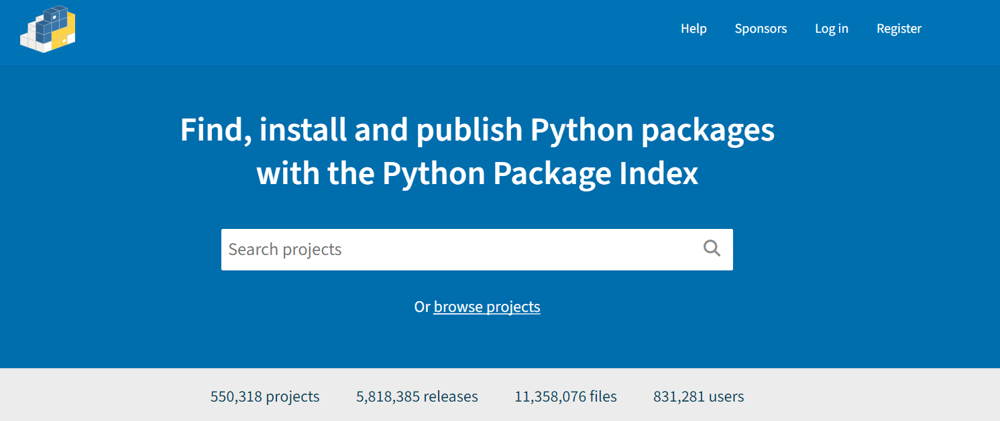
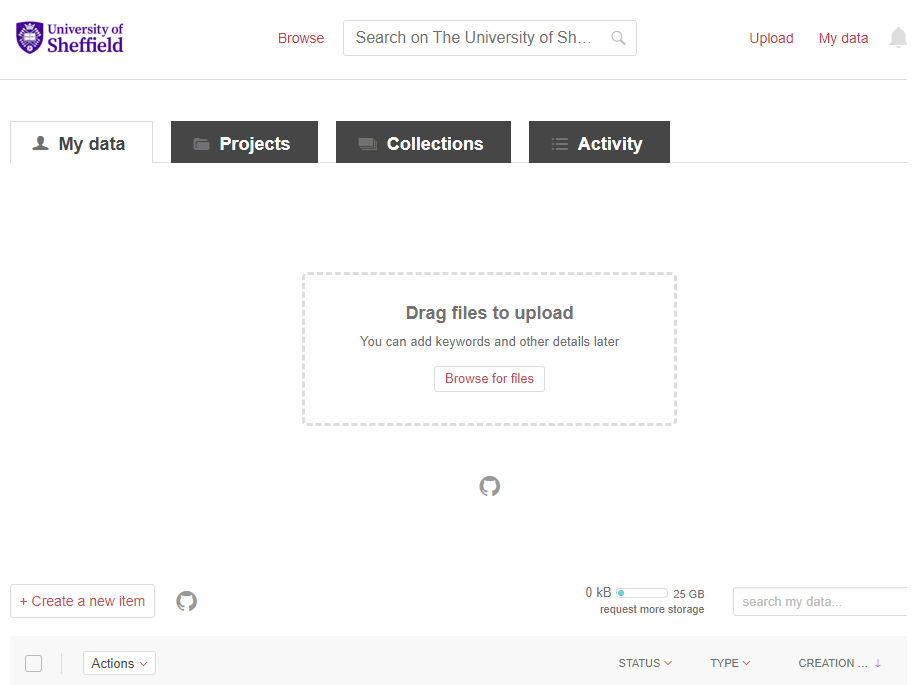

:::::::::::::::::::::::::::::::::::::: questions 

- How can GitHub's automation tools help with publishing your software?

- What are the benefits of publishing your software on PyPI and ORDA?

::::::::::::::::::::::::::::::::::::::::::::::::

::::::::::::::::::::::::::::::::::::: objectives

- Learn how to publish your software to PyPI and The University of Sheffield's ORDA repository.

::::::::::::::::::::::::::::::::::::::::::::::::
## Publishing your Software

### Python Packaging Index


<figure style="text-align: center;">
    
    <figcaption><em>Figure 2: Screenshot of the main landing page of PyPI. GitHub.</em>.</figcaption>
</figure>

Now that we have covered how to release specific versions of your software, we will turn to how to publish your package on an online repository that allows others to easily install and use you software. [PyPI](https://pypi.org/) (or the Python Packaging Index) is the official package repository for the Python community. It serves as the central location where developers can publish and share their packages, making them easily accessible to the wider community. When we use `pip` to install packages from the command line, it fetches them from PyPI by default. Uploading your packages to PyPI is recommended if you want to distribute your projects widely, as it allows other developers to easily find, install, and use your software.


::::::::::::::::::::::::::::::::::::: callout

Developers often use [TestPyPI](https://test.pypi.org/) for testing and validating packages before they are officially published on PyPI.

::::::::::::::::::::::::::::::::::::::::::::::::

To build the wheels, there are 2 tools that we need to install and use. The first is `build`, which is a command-line tool used to build source distributions, and wheel distributions  of Python projects based on the metadata specified in the `pyproject.toml`. On the other hand, `twine` is the tool we use to securely upload the built distributions to PyPI, which handles tasks like authentication and transfer of package files. 

In practice, the installation and usage of these tools would look something like:

```bash

pip install build 

python -m build

```

This will create `dist/your-project-name-1.0.0.tar.gz` (source distribution) and `dist/your-project-name-1.0.0-py3-none-any.whl` (wheel distribution) in the dist directory. Next, we can use `twine` to securely upload the built distributions to PyPI:

```bash

pip install twine

```

We can also run:

```bash

# Check our files is ready to be uploaded using twine check

twine check dist/*

# Check our package is ready to be uploaded to TestPyPI

twine upload --repository testpypi dist/*

```

Once we have confirmed that everything works as expected on TestPyPI, we may proceed with installing our package to PyPI:


```bash

twine upload dist/*

```

Finally, once our package is available on PyPI this means that other users can install the package using the command:

```bash

pip install your-project-name

```

## Automating Publishing to PyPI

::::::::::::::::::::::::::::::::::::: challenge

## Challenge 1: Automate Publishing to testPyPI

Automate releasing

:::::::::::::::::::::::: hint

## Hint

There are several pre-exisiting GitHub Actions that you could use, for example: [gh-action-pypi-publish](https://github.com/pypa/gh-action-pypi-publish)

:::::::::::::::::::::::::::::::::

:::::::::::::::::::::::: solution

## Solution


Create a workflow file in `.github/workflows/` called `release-to-pypi.yml` with the following content:


```yaml

name: Publish Python distribution to TestPyPI

on:
  push:
    tags:
      - 'v*'

jobs:
  build:
    name: Build distribution 📦
    runs-on: ubuntu-latest

    steps:
    - uses: actions/checkout@v4
      with:
        fetch-depth: 0
        persist-credentials: false
    - name: Set up Python
      uses: actions/setup-python@v5
      with:
        python-version: "3.x"

    - name: Install pypa/build
      run: >-
        python3 -m
        pip install
        build
        --user
    - name: Install build dependencies
      run: python3 -m pip install build setuptools setuptools_scm
    - name: Build a binary wheel and a source tarball
      run: python3 -m build
    - name: Store the distribution packages
      uses: actions/upload-artifact@v4
      with:
        name: python-package-distributions
        path: dist/

  publish-to-testpypi:
    name: Publish Python 🐍 distribution 📦 to TestPyPI
    needs:
    - build
    runs-on: ubuntu-latest

    environment:
      name: testpypi
      url: https://test.pypi.org/p/<package-name>

    permissions:
      id-token: write  # IMPORTANT: mandatory for trusted publishing

    steps:
    - name: Download all the dists
      uses: actions/download-artifact@v4
      with:
        name: python-package-distributions
        path: dist/
    - name: Publish distribution 📦 to TestPyPI
      uses: pypa/gh-action-pypi-publish@release/v1
      with:
        repository-url: https://test.pypi.org/legacy/

```

The above instructions triggers a GitHub Actions workflow that automatically publishes a Python package to Test PyPI whenever a new tag starting with "v" is pushed to the repository.

:::::::::::::::::::::::::::::::::
::::::::::::::::::::::::::::::::::::::::::::::::


::: spoiler

### Trusted Publishers

This method makes use of the latest recommended authenticated method called [Trusted Publishers](https://docs.pypi.org/trusted-publishers/). Trusted Publishers is a security enhancement for automating the publishing of Python packages to PyPI, particularly from continuous integration systems like GitHub Action. Instead of relying on long-lived API tokens, Trusted Publishers uses the [OpenID Connect](https://www.microsoft.com/en-us/security/business/security-101/what-is-openid-connect-oidc) (OIDC) authentication protocol to authenticate and authorise CI/CD workflows, which creates a secure and token-less method for package uploads. When a trusted workflow runs, it generates short-lived OIDC tokens that PyPI verifies, and ensures that only authorised workflows from a specific repository or organisation can publish. Although this method is out the scope of this episode, we recommend you to read about the Trusted Publishers approach, and consider its advantages and disadvantages before applying it to your workflows.

:::


### Publishing to ORDA 


<figure style="text-align: center;">
    
    <figcaption><em>Figure 3: Screenshot of the main landing page of Figshare. GitHub.</em>.</figcaption>
</figure>

At The University of Sheffield, researchers also use another popular repository called [`ORDA`](https://figshare.com/). ORDA is the University's main research data repository, facilitating the sharing, discovery, and preservation of the university's research data. Managed by the University Library’s Research Data Management team and provided by Figshare, ORDA assigns a DOI (Digital Object Identifier) to each deposited record, ensuring its accessibility and citability. Researchers are encouraged to use ORDA unless a subject-specific repository or data center is more commonly used in their field. ORDA supports the FAIR principles, and by extension the FAIR4RS principles, by making research outputs citable, discoverable, and easily accessible to a wider research community. As with PyPI, you should first sign up to ORDA (note; you should use your university credentials to create your account).


<figure style="text-align: center;">
    
    <figcaption><em>Figure 4: Demonstration of how to upload data or software sources to ORDA. GitHub.</em>.</figcaption>
</figure>

Figure 4 demonstrates how to upload your project to ORDA using their graphical user interface functionality. There is also the option to connect your project's GitHub account to ORDA, allowing further portability between the two platforms. Once you have published your software on ORDA, it is readily available for other researchers to use and cite in their own research.


::::::::::::::::::::::::::::::::::::: challenge

## Challenge 2: DOI and Reproducibility

In a research context, why is it important to cite software releases via a DOI for example, alongside academic papers?

:::::::::::::::::::::::: solution

## Solution

Citing software releases via a DOI alongside academic papers in research is crucial for several reasons. Firstly, it enhances reproducibility by providing clear references to the specific versions of software used in research. This allows other researchers to replicate and verify findings, ensuring the reliability of published results. Secondly, it promotes transparency by documenting the tools and methods used in studies, which is essential for research validation and building upon existing work. Also, citing software releases acknowledges the contributions of software developers and teams, ensuring they receive proper credit for their work, much like authors of academic papers.

:::::::::::::::::::::::::::::::::
::::::::::::::::::::::::::::::::::::::::::::::::

Another useful integration feature ORDA enables is the use of their API, which allows developers to further automate their software publishing. As with the example above using PyPI, we can also use GitHub to create a CI/CD workflow that triggers a release to ORDA once we have officially published a release of our software. An example file for this workflow could look something like:


```yaml

name: Upload to ORDA
on:
  release:
    types: [published]

jobs:
  upload:
    runs-on: ubuntu-latest
    steps:
      - name: Prepare Data Folder
        run: mkdir 'data'
      
      - name: Download Archive
        run: |
          curl -sL "${{ github.event.release.zipball_url }}" > "${{ github.event.repository.name }}-${{ github.event.release.tag_name }}.zip"
          curl -sL "${{ github.event.release.tarball_url }}" > "${{ github.event.repository.name }}-${{ github.event.release.tag_name }}.tar.gz"
      
      - name: Move Archive
        run: |
          mv "${{ github.event.repository.name }}-${{ github.event.release.tag_name }}.zip" data/
          mv "${{ github.event.repository.name }}-${{ github.event.release.tag_name }}.tar.gz" data/
      
      - name: Upload to Figshare
        uses: figshare/github-upload-action@v1.1
        with:
          FIGSHARE_TOKEN: ${{ secrets.FIGSHARE_TOKEN }}
          FIGSHARE_ENDPOINT: 'https://api.figshare.com/v2'
          FIGSHARE_ARTICLE_ID: YOUR_ID_NUMBER
          DATA_DIR: 'data'

```

The file above is tailored for uploading data to ORDA upon triggering by a published release event. It begins by preparing a data folder, downloading the archive associated with the release tag, moving the downloaded files to the data directory, and finally using the `figshare/github-upload-action` integration to upload the data to ORDA using the specified token, endpoint, article ID, and data directory. Note, you can create your own personal Figshare token in your account settings. Importantly, remember that as with the PyPI username and password, your Figshare token is sensitive and must be passed in as a secret or environment variable.

Finally, once you have uploaded your file sources to ORDA, your software will be readily available for other researchers to use, allowing significant progress towards building a transparent and reproducible research software environment for all involved.

::::::::::::::::::::::::::::::::::::: keypoints 

- You can easily publish your package on PyPI for the wider Python community, allowing your users to simply install your software using `pip install`.

- The University of Sheffield's ORDA repository is another valuable platform to upload your software, further enabling software reproducibility, transparency, and research impact for all project collaborators involved.


::::::::::::::::::::::::::::::::::::::::::::::::

